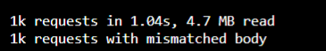

Install Dependencies

`npm install`

Steps to reproduce autocannon issue 

- `npn run app-dev`

- In new terminal run 

  `npm run customAutocannon`

### Current scenario

### Expected scenario

There should be no mismatch since both below responses are identicals

- [toCompareResponse](https://gist.github.com/matt212/65383bd9f183a1b6449e87437fc61bdd)
- [apiResponse](https://gist.github.com/matt212/742d761f5415d5a774368496caf95976)